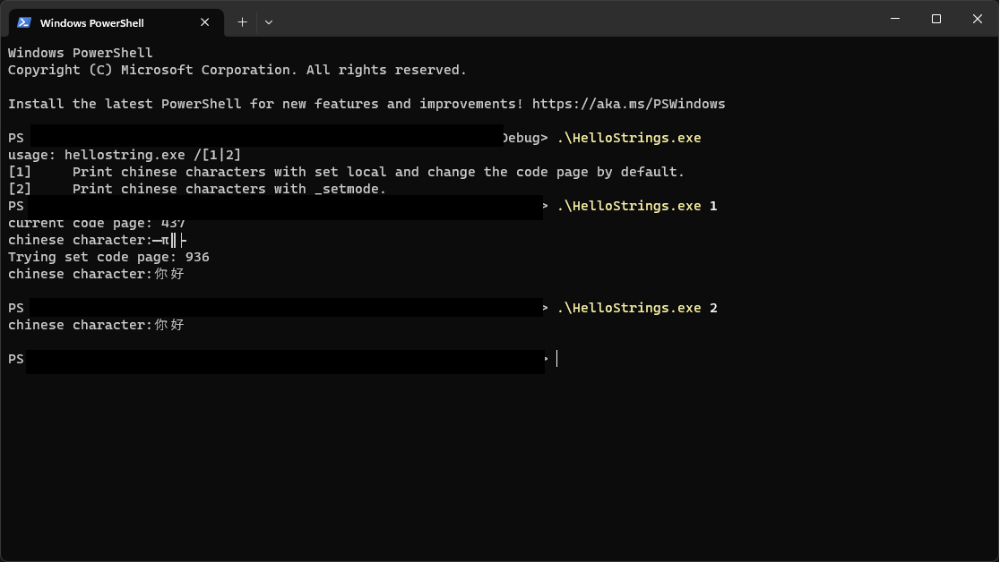

# This repro is used to test print chinese string in consolse

Below is 2 different ways to make it works.

## Set local
This way also requre to change the corrindponding code page to show the characters correctly!
` wcout.imbue(locale("chs"));`

`DWORD err=SetConsoleOutputCP(936);`
## _setmode
`_setmode(_fileno(stdout), _O_U16TEXT);`
## Reference

[Supported Codepage in Windows](https://learn.microsoft.com/en-us/openspecs/windows_protocols/ms-ucoderef/28fefe92-d66c-4b03-90a9-97b473223d43)

